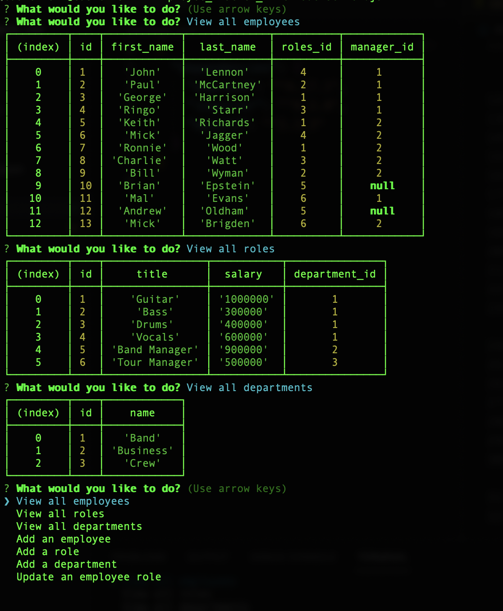
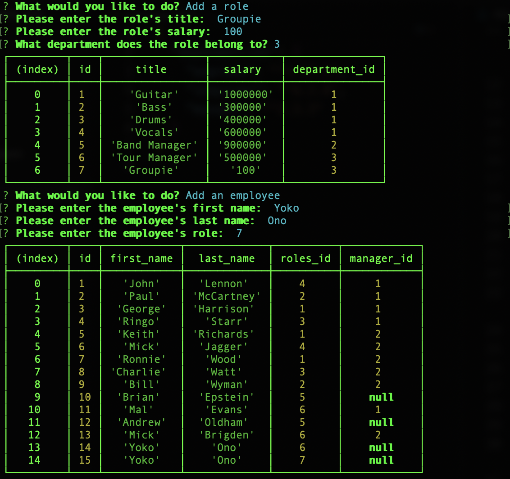

# 🏗️ Employee Management System

Link : https://watch.screencastify.com/v/2h1cHo2AvYeVuBfXuIA7

## Description 📖

The Employee Management System allows a user to build a database for a company. Through a series of command line prompts, the user can add an employee, a role, or department to a database that stores this information. The user can also view the existing database tables, depending on what they would like to observe.

## Features 📝

The Employee Management System uses MySQL to create a database. It employs inquirer to prompt the user in the command line and express.js to communicate the information between the user and the database.

## Screenshots 📷 :

* User is prompted upon accessing the server using node:

  
  
* User view an existing tables in the database:

  

* User add a role, employee, or department to the databse:

  
  

## Takeaways 💡

 I learned how to employ node modules to connect the front and back ends of an application, including Express.js and fs.

I also learned how to employ http methods to retrieve data from a database, as well as post and delete that data.

----
© 2021 Caswell Orr. Confidential and Proprietary. All Rights Reserved.